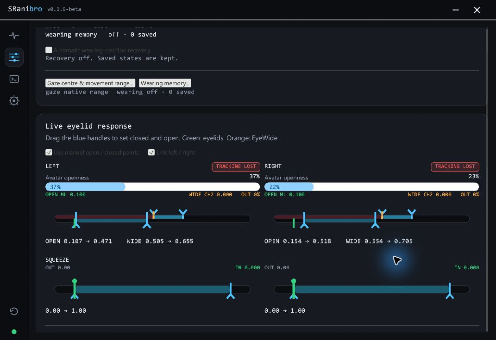
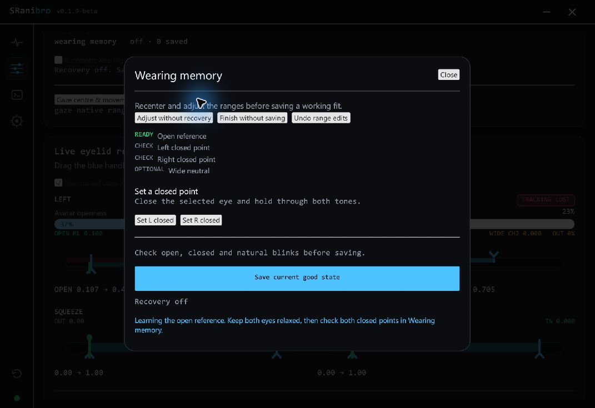

# SRanibro

Eye and eyelid tracking for VR. Bring gaze, blinks, EyeWide and eyebrows to VRCFaceTracking.

## Download

| Platform | Build | Headsets |
| --- | --- | --- |
| **Windows 10 / 11 x64** | **[v0.1.10-beta — download ZIP](https://github.com/challenger0303/SRanibro/releases/download/v0.1.10-beta/SRanibro-v0.1.10-beta-Windows.zip)** | Tobii-equipped, hot-mirror headsets, PSVR2, and Dream Air / SE (XR5 beta) |
| **Linux x86_64** | **[v0.1.9-beta — download tar.gz](https://github.com/challenger0303/SRanibro/releases/download/v0.1.9-beta/SRanibro-PSVR2-0.1.9-beta-linux-x86_64.tar.gz)** | **PSVR2 only · experimental** · glibc 2.39+ |

**Windowsはv0.1.10-beta。Linux版はPSVR2専用の実験版です。**

[English guide](USER_GUIDE.md) · [日本語ガイド](USER_GUIDE.ja.md) · [Release notes](https://github.com/challenger0303/SRanibro/releases/tag/v0.1.10-beta)

Extract the whole Windows ZIP. It includes the XR5 eyelid model, eyebrow model and VRCFT module; keep `models` and `model-runtime` beside the EXE. SRanipal model weights are not included.

### Headsets

- **Hot-mirror:** Pimax Crystal / Crystal Super (VR4), StarVR One, and Varjo through a supported camera path. Uses your SRanipal EyePrediction model.
- **PSVR2:** requires PSVR2Toolkit and SteamVR, plus your SRanipal model.
- **Dream Air / SE (XR5):** the bundled native model provides openness and EyeWide, without Python or SRanipal. Squeeze is not supported by this model. The SRanipal + image-transform option remains available.

## Adjust eyelids by eye

Watch the model response and drag the handles to set closed, open and Wide ranges. Changes apply live; no long calibration sequence is required. Squeeze has its own range when supported by the model.

## Keep a good fit

Save a wearing position after checking your blinks and winks. **Wearing Memory** can recall corrections when the camera view matches a saved state. Memories stay on your PC and are separated by headset.

UI screenshots from the pre-release build (v0.1.9 title). Tracking was unavailable during capture; no eye-camera images are shown.

## More controls, when you need them

- **Gaze:** adjust center and movement range; Crystal Super also has a gaze-source selector and optional smoothing.
- **Eyebrows:** link them to EyeWide, or use the included independent eyebrow model.
- **Camera output:** stream eye images to compatible software. XR5 supports up to 120 frames/s per eye; camera-only mode stops local model inference.
- **Performance:** GPU eyelid processing with CPU fallback, plus an optional camera preview.

## License

The app is a closed-source, binary-only beta. © 2026. Permission is limited to running the beta as provided; link to the release instead of redistributing the EXE. Full app terms are to follow.

The separate [`sranibro-core`](sranibro-core/) source is [MIT-licensed](sranibro-core/LICENSE). GitHub's generated source archives do not contain the closed-source application.

SRanibro is independent and is not affiliated with or endorsed by Tobii, HTC, Pimax, StarVR, Varjo, Sony, VRChat or VRCFaceTracking. Trademarks belong to their respective owners.
